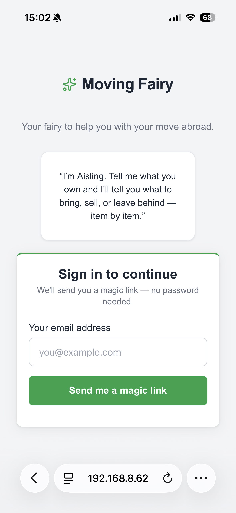
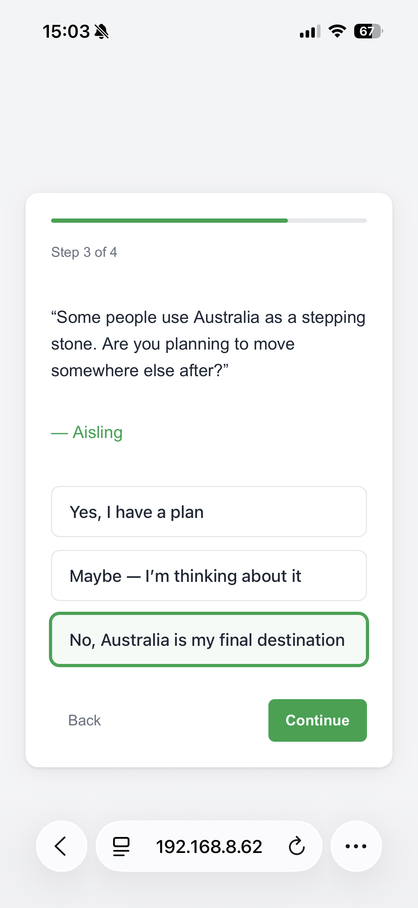
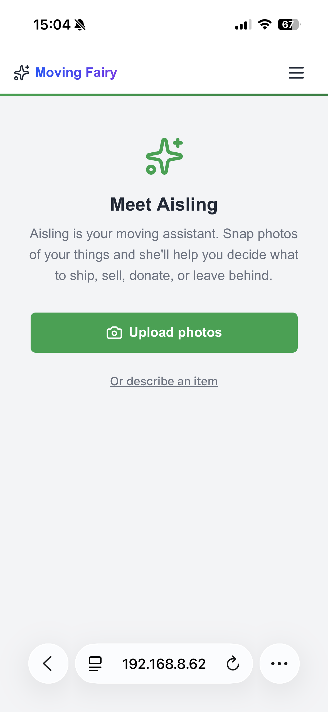
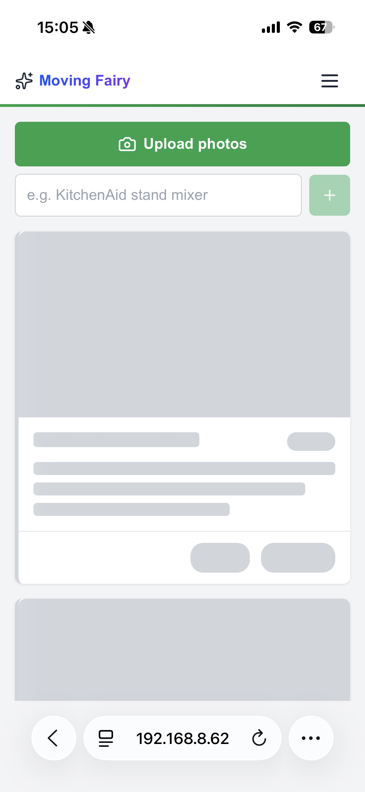

# Moving Fairy

**An AI-powered relocation assistant that helps people emigrating from the US decide what to ship, sell, donate, or leave behind — item by item.**

Moving Fairy is part of [thefairies.ie](https://thefairies.ie), a platform I'm building to explore how AI agents can solve real, messy, human problems — not just productivity ones.

  
  

---

## The problem

Emigrating means making hundreds of small decisions under pressure. Every item you own becomes a question: ship it or replace it? Will it work on Irish voltage? Can it clear Australian biosecurity? Is it worth the shipping cost, or should you sell it and buy again at the destination?

People turn to Reddit threads, expat forums, and guesswork. The advice is scattered, contradictory, and never specific to your route. Nobody tells you that your KitchenAid mixer will work fine on a step-down transformer but your slow cooker won't, or that shipping a bookshelf costs more than buying one in Dublin.

## What Moving Fairy does

The app introduces you to **Aisling**, an AI agent who knows the specifics of your move — your departure country, destination, any onward plans, and what equipment you're bringing (like voltage transformers). You give her your items by snapping photos or describing them, and she assesses each one independently in the background.

  
  

Each assessment is a structured verdict — ship, sell, donate, discard, carry, or revisit — with a clear rationale covering voltage compatibility, shipping economics, import restrictions, and whether the item is worth replacing at the destination. Aisling doesn't just give you an answer; she shows her reasoning so you can make an informed call.

The key design decision: **this is not a chatbot.** Aisling works in the background while you keep adding items. Results appear as cards on your decisions list as they complete. You can drill into any item to discuss it further, but the default experience is a structured, scannable list of decisions — not a conversation thread you have to scroll back through.

## Design decisions worth noting

**Conversational onboarding, not a form.** The setup flow asks questions the way a person would — adapting based on your answers. If you're moving to a country with the same voltage as your departure country, the transformer question never appears. If you have no onward plans, the multi-leg strategy questions are skipped entirely.

**Background assessment, not blocking chat.** Most AI products default to a chat interface — you ask, you wait, you get a response, you ask again. That works for one-off questions, but not when someone has dozens of items to assess. Moving Fairy runs assessments in parallel in the background. You upload a batch of photos and keep working while verdicts arrive as structured cards on your decisions list. The AI does the heavy lifting without making you watch it think.

**Structured output over freeform text.** Aisling doesn't return paragraphs. She calls a tool that renders a verdict card with specific fields — verdict, confidence, rationale, cost estimates. This is a deliberate constraint on the AI: it forces consistent, comparable output across every item, and it gives users a scannable interface rather than a wall of text.

**Route-aware knowledge, not generic advice.** Aisling's knowledge is composed from modular country-specific guides (US departure rules, Irish import rules, Australian biosecurity) combined with the user's specific route and equipment. A user moving US → Ireland gets different advice than US → Ireland → Australia, because the second leg changes the calculus on what's worth shipping.

## How it's built

| Layer | Choice |
|-------|--------|
| Framework | Next.js (App Router) with TypeScript |
| AI | Claude (Sonnet for full assessments, Haiku for light triage) via structured tool use |
| Database | Supabase Postgres with Row Level Security |
| Image pipeline | Client upload → server-side optimisation (sharp) → Supabase Storage → base64 for Claude vision |
| Design system | Nós DS — a shared component library across the fairies.ie platform |
| Infrastructure | Fly.io, EU region (Amsterdam/Frankfurt). All data stays in the EU. |
| Testing | Vitest + Testing Library (unit), Playwright (E2E across desktop, mobile Safari, tablet) |

The architecture enforces a strict boundary: the app and the AI agent never touch the database directly. All reads and writes go through an MCP (Model Context Protocol) server, which means Aisling's capabilities are defined by explicit tools — not by giving an LLM raw database access.

## Status

This is a side project in active development. The core assessment flow works end to end — onboarding, item upload, background assessment, and the decisions list. Box management (packing, shipping tracking) and per-item chat are in progress.

## About this project

I'm a Product Designer building this to explore a question I keep running into in my work: **how do you design AI products that are genuinely useful, not just impressive?**

Most AI product demos show the happy path — a clean prompt, a perfect response. The interesting design problems are elsewhere: what happens when the AI is uncertain? How do you structure output so it's scannable, not just readable? When should the AI work in the background versus in conversation? How do you build trust with users who've been burned by bad chatbot experiences?

Moving Fairy is where I work through those questions with real users and a real problem domain. The constraint of relocation — high stakes, high emotion, domain-specific knowledge, multi-step decisions — makes it a genuinely hard test for AI-assisted product design.

The entire application, including the AI agent's persona, knowledge modules, and tool definitions, was built using Claude Code as my implementation partner. The design system, UX flows, and product decisions are mine. The code is the collaboration.

---

**Licence:** This software is proprietary. See [LICENSE](LICENSE) for details. Source code is provided for portfolio evaluation only — no permission is granted to use, copy, or distribute.
