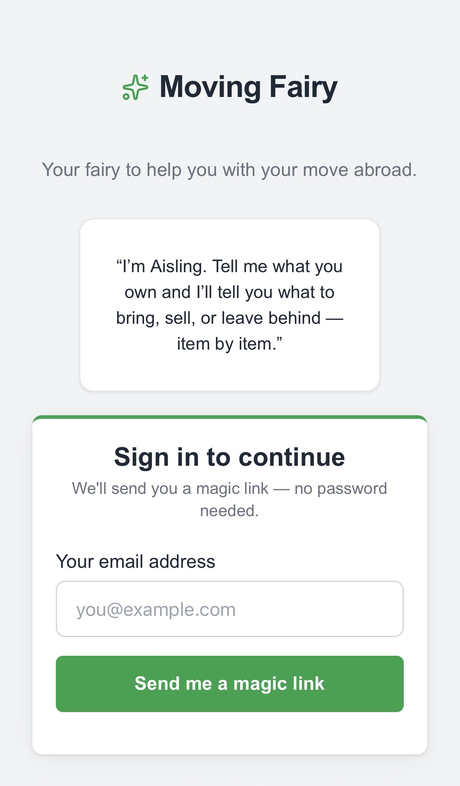
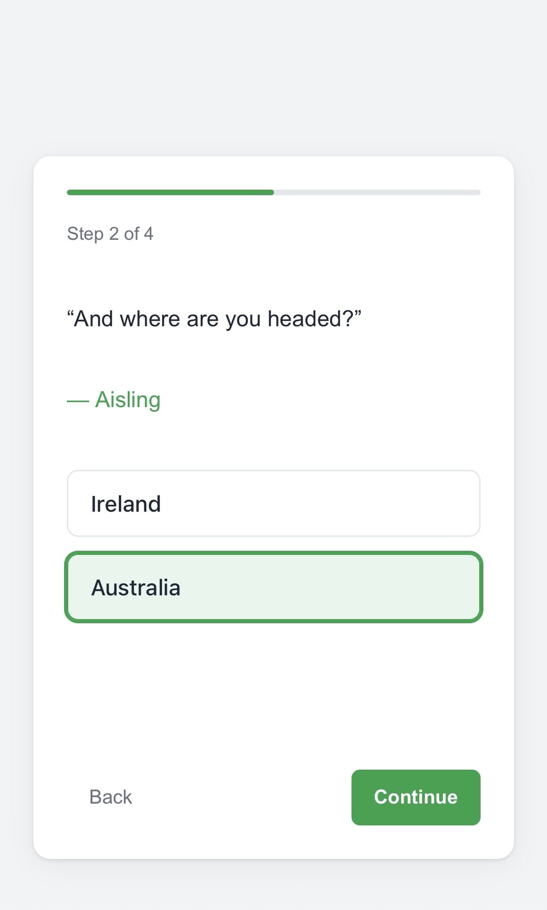
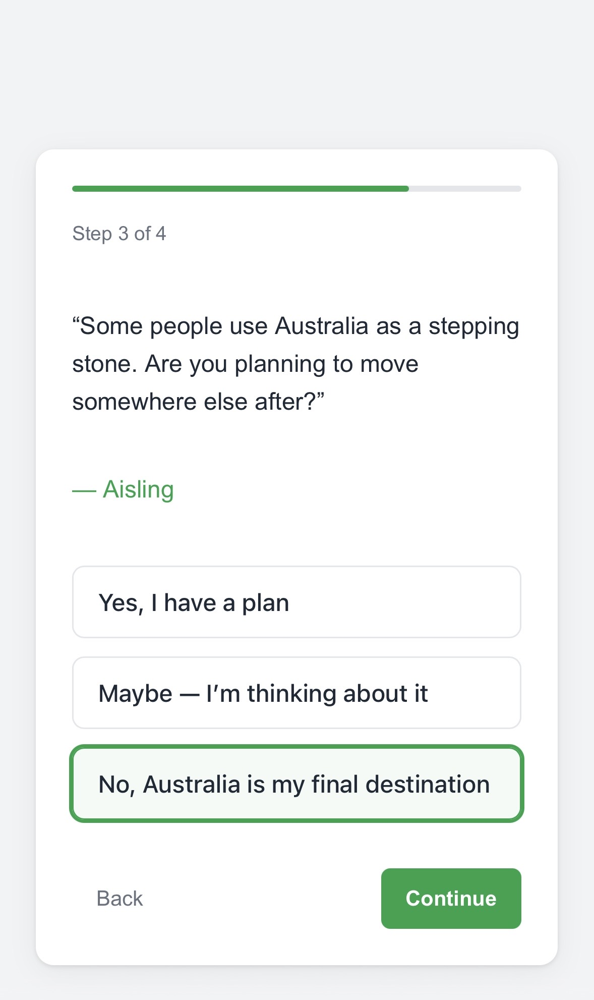
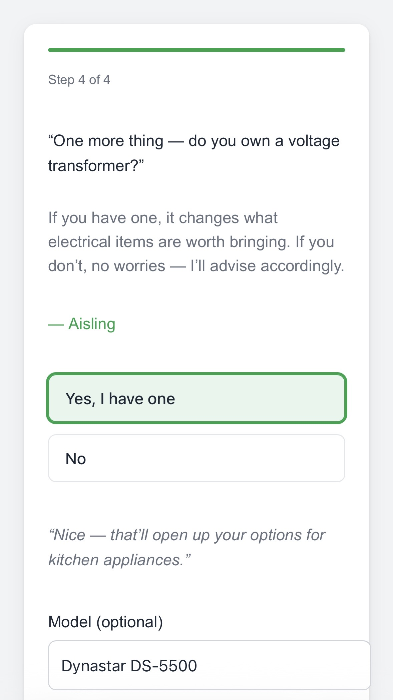
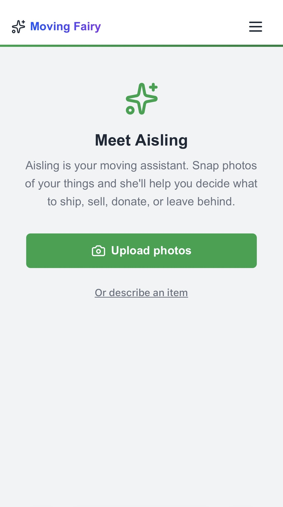
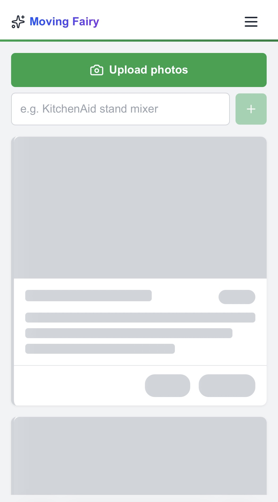
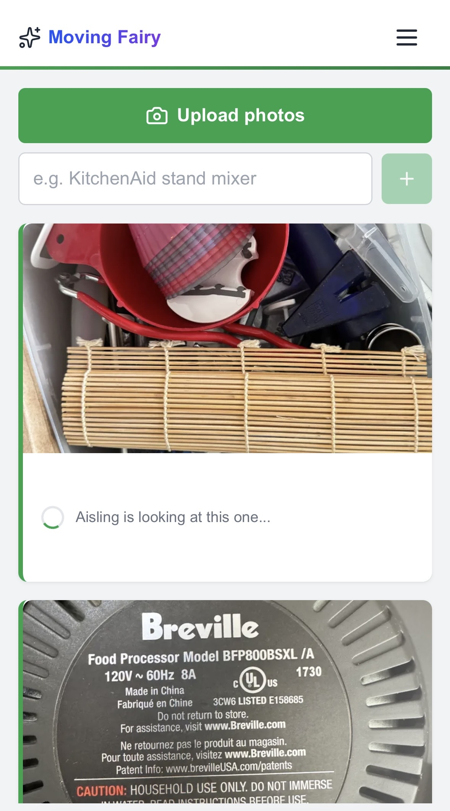
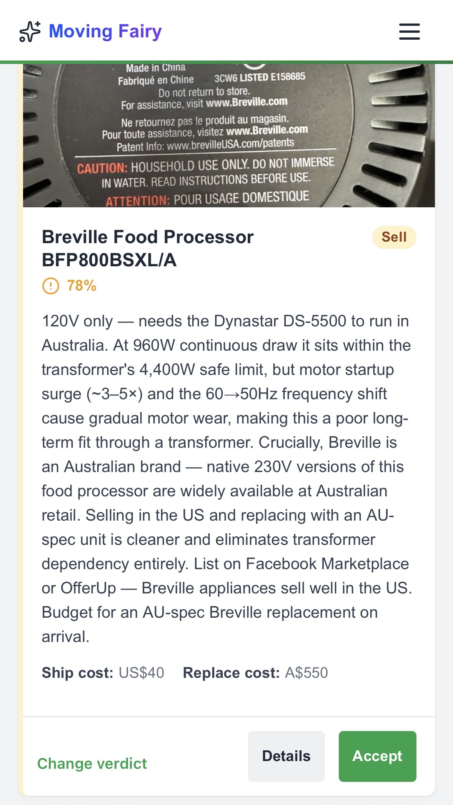

# Moving Fairy

**An AI-powered relocation assistant that helps people emigrating from the US decide what to ship, sell, donate, or leave behind — item by item.**

Moving Fairy is part of [thefairies.ie](https://thefairies.ie), a platform I'm building to explore how AI agents can solve real, messy, human problems — not just productivity ones.

---

## The problem

Emigrating means making hundreds of small decisions under pressure. Every item you own becomes a question: ship it or replace it? Will it work on Irish voltage? Can it clear Australian biosecurity? Is it worth the shipping cost, or should you sell it and buy again at the destination?

People turn to Reddit threads, expat forums, and guesswork. The advice is scattered, contradictory, and never specific to your route. Nobody tells you that your KitchenAid mixer will work fine on a step-down transformer but your slow cooker won't, or that shipping a bookshelf costs more than buying one in Dublin.

That's where Moving Fairy comes in. The app introduces you to **Aisling**, an AI agent who knows the specifics of your move — your departure country, destination, any onward plans, and what equipment you're bringing (like voltage transformers). You give her your items by snapping photos or describing them, and she assesses each one independently in the background.

 

---

## Conversational onboarding, not a form

The setup flow asks questions the way a person would — adapting based on your answers. If you're moving to a country with the same voltage as your departure country, the transformer question never appears. If you have no onward plans, the multi-leg strategy questions are skipped entirely.

Aisling doesn't dump a settings page on you. She asks what matters, in the order it matters, and remembers what you said so she can factor it into every decision she makes later.

 

If you're making a multi-leg move (say, US → Ireland → Australia), Aisling needs to know — because the second leg changes the calculus on what's worth shipping. An item that makes perfect sense to bring to Dublin might not be worth carrying onward to Melbourne.

The questions adapt. The flow is short. And everything feeds into the decision engine that assesses your items later.

 

The transformer question is a good example of how context shapes the experience. If you own one, it opens up options for bringing certain electrical items. If you don't, Aisling adjusts her advice accordingly — she won't recommend shipping a 120V appliance to a 230V country without a path to power it.

She even responds to your answer in real time before moving on to the next step.

 

---

## Structured decisions, not chat

The key design decision: **this is not a chatbot.** Most AI products default to a chat interface — you ask, you wait, you get a response, you ask again. That works for one-off questions, but not when someone has dozens of items to assess.

The empty state introduces Aisling and gives you two clear paths: upload photos of your things, or describe an item by name. No instructions to read. No modes to understand. Just start adding items.

 

Once you start adding items, Aisling works in the background while you keep going. Results appear as cards on your decisions list as they complete — you never have to wait for one assessment to finish before starting the next.

The skeleton loading state shows you exactly how many items are being processed, so there's no ambiguity about what's happening.

 

Each item gets its own assessment. Aisling examines the photos you upload — she can read model numbers, identify brands, and spot details that matter for her recommendation. While she's working, you see a clear progress indicator: *"Aisling is looking at this one..."*

You keep adding items. She keeps assessing. The list builds itself.

 

---

## Verdicts you can act on

Aisling doesn't return paragraphs. Each assessment produces a structured verdict card with specific fields — verdict, confidence, rationale, cost estimates. This is a deliberate constraint on the AI: it forces consistent, comparable output across every item.

The example here shows Aisling recommending to **sell** a Breville food processor. She's identified that it's a 120V appliance, calculated it could run through the user's transformer but would suffer motor wear from the frequency shift, and — crucially — noted that Breville is an Australian brand with native 230V versions available locally. Her advice: sell in the US, buy the AU-spec version on arrival.

That's the level of specificity that generic advice can't match. It accounts for the user's specific route, their equipment, the item's electrical requirements, brand availability at the destination, and resale value at the origin.

Every verdict includes ship cost and replacement cost, so users can make the economic comparison at a glance. And if you disagree, you can change the verdict or drill into details.

 

---

## How it's built

| Layer | Choice |
|-------|--------|
| Framework | Next.js (App Router) with TypeScript |
| AI | Claude (Sonnet for full assessments, Haiku for light triage) via structured tool use |
| Database | Supabase Postgres with Row Level Security |
| Image pipeline | Client upload → server-side optimisation (sharp) → Supabase Storage → base64 for Claude vision |
| Design system | Nós DS — a shared component library across the fairies.ie platform |
| Infrastructure | Fly.io, EU region (Amsterdam/Frankfurt). All data stays in the EU. |
| Testing | Vitest + Testing Library (unit), Playwright (E2E across desktop, mobile Safari, tablet) |

The architecture enforces a strict boundary: the app and the AI agent never touch the database directly. All reads and writes go through an MCP (Model Context Protocol) server, which means Aisling's capabilities are defined by explicit tools — not by giving an LLM raw database access.

## Status

This is a side project in active development. The core assessment flow works end to end — onboarding, item upload, background assessment, and the decisions list. Box management (packing, shipping tracking) and per-item chat are in progress.

## About this project

I'm a Product Designer building this to explore a question I keep running into in my work: **how do you design AI products that are genuinely useful, not just impressive?**

Most AI product demos show the happy path — a clean prompt, a perfect response. The interesting design problems are elsewhere: what happens when the AI is uncertain? How do you structure output so it's scannable, not just readable? When should the AI work in the background versus in conversation? How do you build trust with users who've been burned by bad chatbot experiences?

Moving Fairy is where I work through those questions with real users and a real problem domain. The constraint of relocation — high stakes, high emotion, domain-specific knowledge, multi-step decisions — makes it a genuinely hard test for AI-assisted product design.

The entire application, including the AI agent's persona, knowledge modules, and tool definitions, was built using Claude Code as my implementation partner. The design system, UX flows, and product decisions are mine. The code is the collaboration.

---

**Licence:** This software is proprietary. See [LICENSE](LICENSE) for details. Source code is provided for portfolio evaluation only — no permission is granted to use, copy, or distribute.
